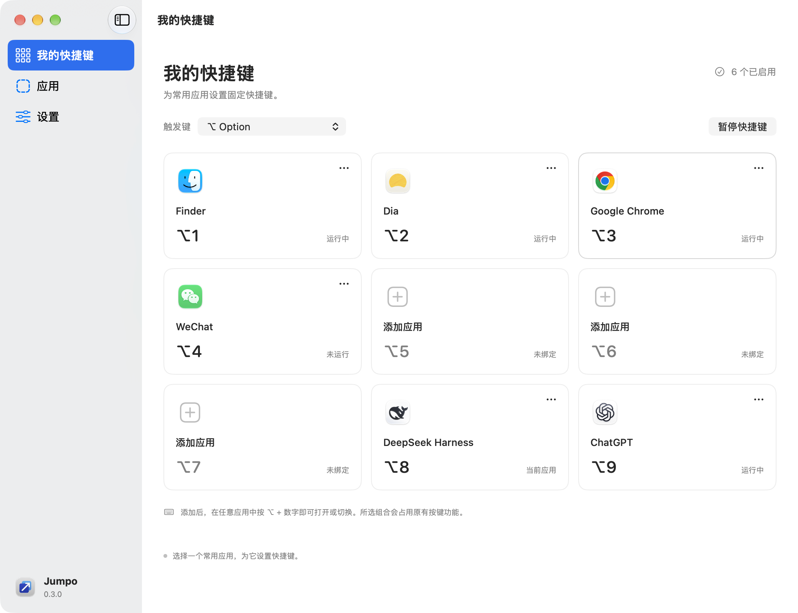
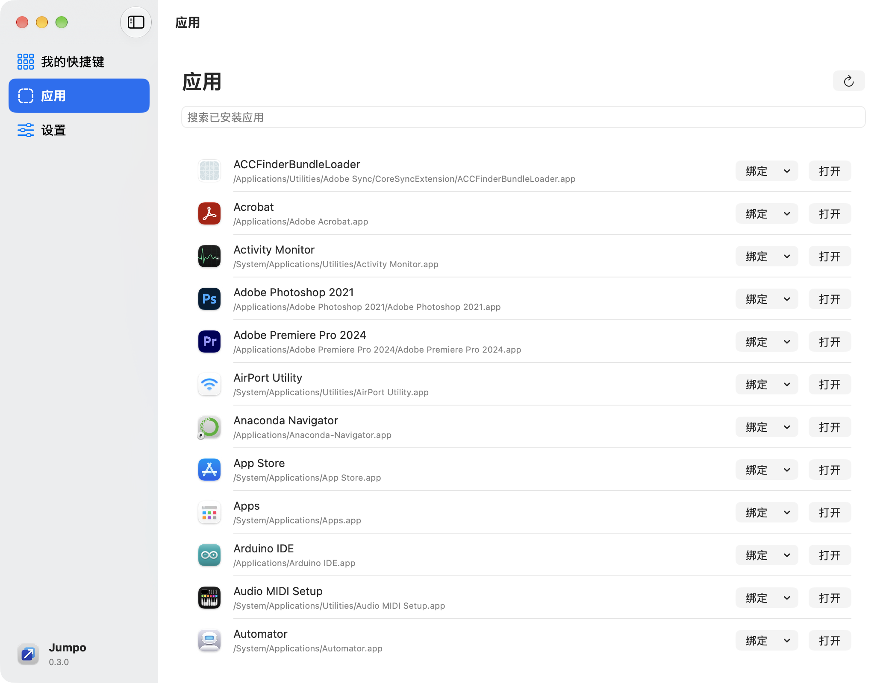
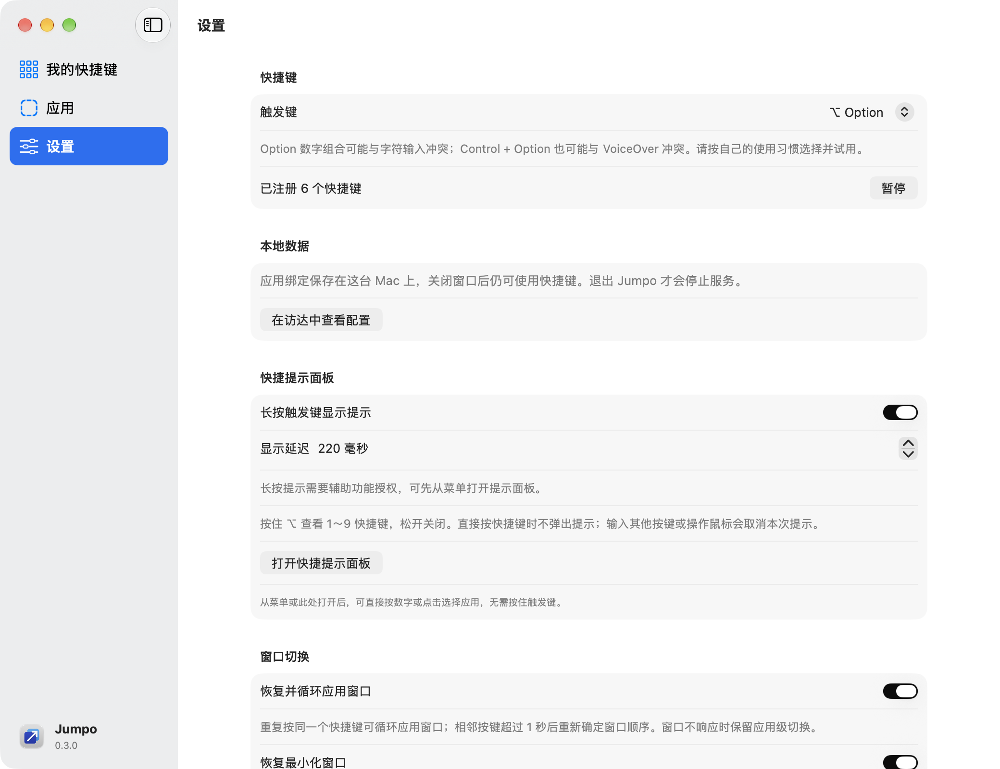

<div align="center">
  
  <h1>Jumpo</h1>
  <p><b>用固定的九宫格快捷键，在 macOS 上启动与切换应用和窗口。</b></p>
  <p>
    
    
    
    
    <a href="LICENSE"></a>
  </p>
</div>

Jumpo 是一个常驻菜单栏的 macOS 应用切换器：把常用应用固定到 1～9 九个槽位，在任何应用里按下修饰键 + 数字即可启动或切换；需要时还能恢复最小化窗口、在同一应用的多个窗口间循环，或按住所选修饰键呼出九宫格提示面板。

仓库同时保存完整的产品、交互与技术文档，见 [文档索引](docs/README.md)。

> [!WARNING]
> Jumpo 目前是 **0.3.0 原型**，不是完整的 V1.0。仓库中的构建产物**只有本地 ad hoc 签名**，既没有 Developer ID 签名，也没有经过 Apple 公证，因此它不是可以分发给其他人安装的正式安装包。首次打开可能需要在「系统设置 → 隐私与安全性」中手动允许。

<div align="center">
  
</div>

## 主要特性

- **九宫格固定快捷键**：1～9 九个槽位，绑定已安装应用，或手动指定任意 `.app`。
- **可换的触发修饰键**：默认 `Option + 数字`，也可切换为 `Control + Option` 或 `Option + Command`。
- **精确的注册语义**：只注册已绑定且启用的槽位；支持暂停、恢复、移除、移动/交换，以及一次撤销。
- **真实的前台确认**：未运行时启动、已运行时激活、隐藏时取消隐藏，并通过实际前台进程确认切换结果，而不是假定成功。
- **窗口级切换**：授权辅助功能后，可恢复选中的最小化窗口，或按固定顺序在同一应用的窗口间循环。窗口不响应时回退到应用级切换。
- **快捷提示面板（HUD）**：按住触发键 220ms（可调 100～1000ms）显示九宫格，松开关闭；也可从菜单或设置页直接打开交互式面板。
- **配置可靠**：原子保存、保留上一份有效配置；保存或注册失败时回滚并保留旧配置。
- **无第三方依赖**：纯 Swift 6 + Swift Package Manager，不需要 Xcode 工程文件，也没有需要审计的外部包。

## 系统要求

| 项目 | 要求 |
| :--- | :--- |
| 系统 | macOS 14 或更高（macOS 14 支持为暂定，实测环境见[验证记录](docs/validation/Prototype_Validation.md)） |
| 工具链 | Apple Swift 6 与 macOS SDK（Command Line Tools 即可，无需完整 Xcode） |
| 依赖 | 无第三方包依赖 |
| 权限 | 辅助功能权限**可选**，仅在窗口恢复与循环、长按提示时需要 |

## 安装

本项目尚未发布正式安装包，请从源码构建：

```sh
git clone https://github.com/cooper-dev-404/Jumpo.git
cd Jumpo

bash scripts/swift.sh build                  # 编译调试版本
bash scripts/swift.sh test --disable-xctest  # 运行 Swift Testing 测试
bash scripts/build.sh                        # 打包并 ad hoc 签名到 dist/Jumpo.app
open dist/Jumpo.app                          # 启动应用
```

`bash scripts/build.sh release` 可请求优化构建。

<details>
<summary>构建到「应用程序」目录，并处理常见问题</summary>

把打包结果放进应用程序目录，访达侧边栏与启动台即可看到并直接启动：

```sh
cp -R dist/Jumpo.app /Applications/
xattr -dr com.apple.quarantine /Applications/Jumpo.app   # 去掉下载隔离标记，避免被 Gatekeeper 拦截
open /Applications/Jumpo.app
```

构建脚本使用 SwiftPM native 后端，把缓存放在 `.build/`、应用放在 `dist/`，两者都不应提交。

若受控环境（容器、CI、IDE 运行器）报 `sandbox-exec: sandbox_apply: Operation not permitted`，那是 SwiftPM 自身的沙箱无法嵌套在另一个沙箱里，不是源码问题。显式关闭即可：

```sh
JUMPO_SWIFTPM_NO_SANDBOX=1 bash scripts/build.sh release
```

替换应用包会改变 ad hoc 签名的指纹，因此**每次重新构建后都可能需要重新授予辅助功能权限**，详见[疑难排查](#疑难排查)。

</details>

## 权限与隐私

### 辅助功能权限

Jumpo 只有在需要窗口能力时才使用辅助功能权限，并且不会在启动时自动弹出授权请求：

- **不授权也能用**：应用级快捷切换、菜单栏、交互式快捷提示面板，以及应用绑定与配置全部可用。
- **授权后解锁**：识别应用的多个标准窗口、恢复选中的最小化窗口、在同一应用的窗口间循环，以及长按触发键显示提示。
- 权限状态在设置页实时显示，可随时在「系统设置 → 隐私与安全性 → 辅助功能」中撤销；撤销后 Jumpo 会取消进行中的窗口请求并清空运行时引用。

### 隐私

- 不记录任何输入内容，也不保存按键序列。
- 不请求屏幕录制权限，不读取窗口标题，不截图或录屏。
- 不请求 Automation / Apple Events 权限。
- 不上传应用清单、绑定关系或使用记录；配置只保存在本机。
- 窗口对象只保留在内存中，不按标题或 PID 单独推定窗口身份。

## 使用

1. 点击任意空槽位，搜索并选择一个已安装应用；也可以从访达指定其他位置的 `.app`。
2. 切换到其他应用，按下槽位上的快捷键即可启动或切换。
3. 卡片右上角的菜单用于停用、更换、移动或移除绑定；不需要快捷键时点击「暂停快捷键」。
4. 需要窗口恢复与循环时，在「设置 → 窗口切换」查看用途后主动授权辅助功能，返回后会刷新权限状态。
5. 从菜单栏选择「打开快捷提示面板」，直接按数字或点击卡片切换；启用长按提示并授权后，也可按住触发键查看，松开即关闭。

长按模式不抢焦点，`Esc` 和其他输入会正常送往原应用。常用按键组合如下：

| 操作 | 快捷键 |
| :--- | :--- |
| 启动或切换槽位 1～9 | <kbd>⌥ Option</kbd> + <kbd>1</kbd> … <kbd>9</kbd> |
| 循环同一应用的窗口 | 重复按同一个槽位快捷键 |
| 按住显示九宫格提示 | 按住 <kbd>⌥ Option</kbd> 约 220ms |
| 关闭提示面板 | 松开 <kbd>⌥ Option</kbd>，或按 <kbd>Esc</kbd> |
| 在提示面板中选择 | 按数字键，或点击卡片 |

> [!NOTE]
> `Option` 数字组合可能影响原有字符输入，`Control + Option` 可能与 VoiceOver 冲突。请按自己的使用习惯选择并试用；注册失败会在设置页显示提示。

## 功能截图

<div align="center">
<table>
  <tr>
    <td align="center"><br><sub><b>我的快捷键</b>：九宫格绑定、运行状态与暂停</sub></td>
    <td align="center"><br><sub><b>快捷提示面板</b>：按数字或点击选择，无需按住触发键</sub></td>
  </tr>
  <tr>
    <td align="center"><br><sub><b>应用</b>：搜索已安装应用并直接绑定槽位</sub></td>
    <td align="center"><br><sub><b>设置</b>：触发键、窗口切换与权限状态</sub></td>
  </tr>
</table>
</div>

## 配置与数据

配置保存在 `~/Library/Application Support/Jumpo/`：

| 文件 | 用途 |
| :--- | :--- |
| `configuration.json` | 当前配置（原子写入） |
| `configuration.backup.json` | 上一份有效配置，供恢复使用 |
| `configuration.unreadable-<UUID>.json` | 仅在配置损坏且用户选择恢复时另存的原文件 |

0.1 的配置可直接加载，绑定不变，新设置在下一次保存时写入。暂停仅在本次进程内生效；退出后不再占用快捷键，重启会重新注册已启用的槽位。关闭设置窗口后 Jumpo 继续在菜单栏运行，再次打开 `.app` 会恢复设置窗口。

## 疑难排查

<details>
<summary>重新构建后辅助功能权限失效</summary>

`dist/Jumpo.app` 只有 ad hoc 签名，替换应用包会改变代码签名指纹。系统列表中的开关可能仍显示为打开，但新的构建实际并未获得授权。

1. 在「系统设置 → 隐私与安全性 → 辅助功能」中先关闭再重新启用 Jumpo，然后重启应用。
2. 若设置页仍显示「未授权」，移除该条目并重新添加当前的 `dist/Jumpo.app`；系统可能要求触控 ID 验证。
3. 应用级切换不依赖此权限，仍然可用。

</details>

<details>
<summary>快捷键注册失败或未生效</summary>

- 设置页会显示注册错误；注册成功只代表 Jumpo 已注册，不代表已检测出所有系统或第三方冲突。
- 若另一个 Jumpo 实例仍在运行，它会占用同一组快捷键，导致新实例注册失败。先退出旧实例（菜单栏 → 退出 Jumpo）。
- Secure Input 或系统会话暂停时，长按提示会关闭并显示原因。

</details>

## 工程结构

- `Sources/JumpoCore/`：配置、持久化、快捷键事务、窗口循环规则与异步切换协调。
- `Sources/Jumpo/`：SwiftUI 设置页、AppKit 菜单栏与生命周期、Carbon 热键、NSWorkspace 与 Accessibility 服务。
- `Tests/JumpoCoreTests/`：配置恢复、注册回滚及异步请求行为的 Swift Testing 测试（当前 51 项）。
- `Resources/`、`scripts/`：应用包元数据与构建脚本。
- `Tools/WindowFixture.swift`：三个不含用户数据的测试窗口，运行 `bash scripts/build-fixture.sh` 构建到 `.build/`，用于实机验证。
- `docs/`：产品规格、技术论证与验证记录，入口见 [文档索引](docs/README.md)。

## 开发路线

- [x] 九宫格固定槽位、绑定/移动/移除与一次撤销
- [x] 只注册启用的槽位，失败回滚并保留旧配置
- [x] 启动、激活与取消隐藏，并通过实际前台确认结果
- [x] 窗口恢复、最小化窗口处理与同应用窗口循环
- [x] 长按与交互式快捷提示面板（HUD）
- [x] 应用图标与设置页版本信息
- [ ] 完整首次引导
- [ ] 登录时启动
- [ ] 自动更新
- [ ] 正式发布签名与公证
- [ ] 确认最低 macOS 版本与 Intel 支持范围

**明确暂缓**：全局快速搜索（2026-10-04 决定由 macOS 聚焦搜索满足该需求），不属于当前版本开发与验收范围；设置页内用于绑定的应用搜索继续保留。Window Picker 保留为 V1.1 / P1。

## 验证状态

自动化测试通过不代表操作系统集成已验证。当前哪些项目已经实机确认、哪些仍未验证，记录在[原型验证记录](docs/validation/Prototype_Validation.md)中；完整范围见[文档评审与开发准备](docs/technical/Jump_Review_and_Development_Readiness_V1.0.md)。

## 许可证

本项目基于 [MIT 许可证](LICENSE) 发布。
